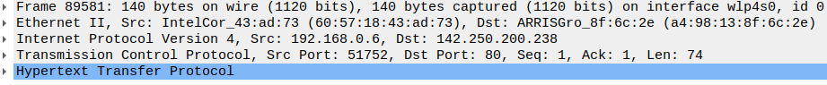

**Inspecting OSI Layers via WireShark**

Wireshark is a popular network protocol analyzer that allows users to capture and inspect network traffic in real time, making it a valuable tool for network troubleshooting and analysis.

1. Install it on Ubuntu:
[https://www.wireshark.org/docs/wsug_html_chunked/ChBuildInstallUnixInstallBins.html#_installing_from_debs_under_debian_ubuntu_and_other_debian_derivatives(https://www.wireshark.org/docs/wsug_html_chunked/ChBuildInstallUnixInstallBins.html#_installing_from_debs_under_debian_ubuntu_and_other_debian_derivatives)
1. Run it by:
    ```linux
    myuser@hostname:~$ wireshark
    ```
1. Start capturing packets, by clicking on the <span style="display:inline"></span> button
1. In Wireshark, apply the following filter to catch only packets destined for google.com by clicking this button: 
    ```linux
    http.host == "google.com"
    ```
1. From your terminal, use the `curl` command to get the main page of `google.com`
    ```linux
    myuser@hostname:~$ curl google.com
    ```
1. Explore the **packet details pane**. 

This pane displays the contents of the selected packet (packet here is referred to as “any piece of data that traverses down the model layers”). You can expand or collapse each layer to view the details of the corresponding layer, such as the source and destination addresses, protocol flags, data payloads, and other relevant information.

Answer the below questions. Don’t butter yourself if you are not familiar with every small detail.  Some of the concepts here will be taught soon. Based on our discussion on the OSI model, and your previous knowledge in computer networking, try to look for the relevant information. 

1. How many layers does the packet cross?
1. What is the top layer, which is the lower? 
1. The “network interface” layer is not part of the original OSI model. It is composed by the two lower layers of the original model, what are those two layers according to the packet details pane on your WireShark screen?
1. How does the original message to google.com (the HTTP request) look like in the top layer? 
1. Is the packet sent using TCP or UDP?
1. What is the length of the transport layer segment? 
1. To how many segments the original message has been segmented? 
1. Which version of IP protocol did you use in the Internet layer?
1. In the Internet layer, what is the destination IP of the packets?
1. What is the MAC address of your device?
1. How many bits have been transmitted over the wire to google’s servers?
1. What is the protocol sequence that the frame (the lower level piece of data) have been composed of?  

<details>
  <summary>
    Solution
  </summary>

1. 5 layers, as can be seen in the packet details view
1. Hypertext Transfer Protocol (http) - the lower layer in the  packet details view (but the upper layer in the OSI model)
1. Network Interface = Ethernet II + Frame  - the top 2 layers in the packet details view (in real life, those are the 2 lower layers -  called the link layer and the physical layer).
1. 
    ```linux
    GET / HTTP/1.1\r\n
    Host: google.com\r\n
    User-Agent: curl/7.68.0\r\n
    Accept: */*\r\n
    \r\n
    [Full request URI: http://google.com/]
    [HTTP request 1/1]
    [Response in frame: 89634]
    ```
1. Transmission Control Protocol (TCP). This is the name of one of the layers in the packet details view. 
1. Segment is the name of a piece of data residing in the TCP layer. If you expand the TCP layer in the packet details view,  you’ll notice:
    ```linux
    [TCP Segment Len: 74]
    ```
1. Since after the curl command only one packet was caught by Wireshark, we can conclude that this message was transferred by one segment. 
1. IPv4, as the name of the 3rd layer in the packet details view: 
    ```linux
    Internet Protocol Version 4
    ```
1. By expanding the **Internet Protocol Version 4** layer, we can find the destination IP:
    ```linux
    Destination: 142.250.200.238
    ```
1. By expanding the **Ethernet II** layer, we can find the device MAC address (the value in the parentheses)
    ```linux
    Source: IntelCor_43:ad:73 (60:57:18:43:ad:73)
    ```
1. 1120 bits, as can be seen in the **Frame** layer
1. As can be seen in the Frame layer:
    ```linux
    eth:ethertype:ip:tcp:http
    ```

</details>