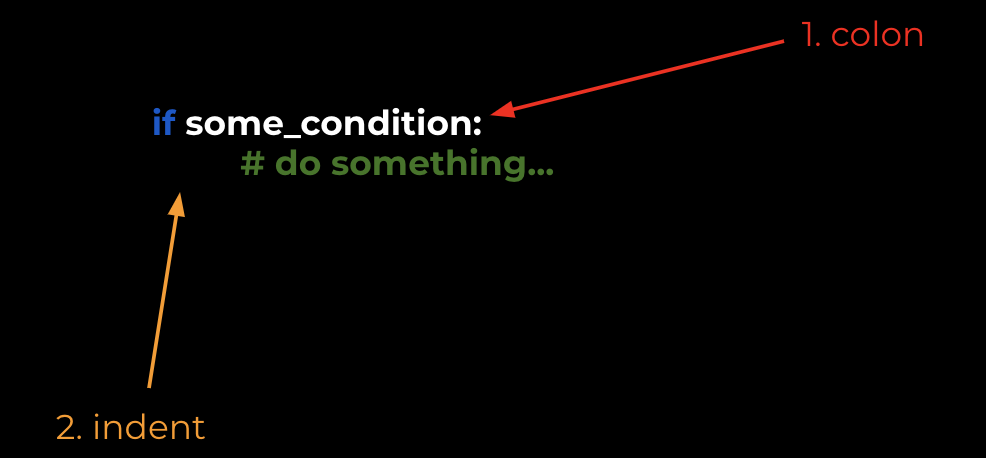

Notice something important about the syntax of the `if` statement:





1. You have to have the colon at the end of the condition
2. You **have** to skip a line and **indent** (press Tab) any code that you want to execute as a result of your condition


Python **enforces** this idea of indentation, and this introduces the idea of a **code block** in Python.


We will see other **blocks** of code in Python, and they will always be define by their indentation. For example, in the following code:


```python
if some_condition:
	print(1)
	print(2)

print(3)
```

We will only see `1` and `2` in the output *if* `some_condition` is `True`, but we will *always* see `3` in the output because that is outside of the `if`'s code block.

In other words, we can say that `print(1)` and `print(2)` are **inside the `if`'s block**.


To be clear: **if you do not indent correctly in Python, it will cause bugs**.