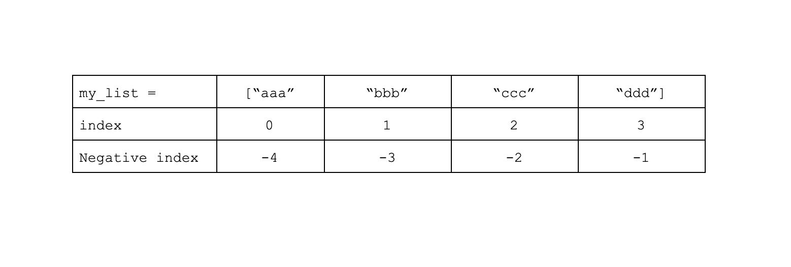

Another way to access list elements is using the **slice operator**. The slice operation - colon ` : ` returns a new list containing a range of items.


```python
my_list = ["aaa", "bbb", "ccc", "ddd"]

# Accessing elements 2nd until 4th
print(my_list[1:4]) # output: ['bbb', 'ccc', 'ddd']
```

Slicing can have negative indexes as well:


```python
my_list = ["aaa", "bbb", "ccc", "ddd"]

# Accessing elements 2nd until 4th
print(my_list[-3:-1]) # output: ['bbb', 'ccc']
```

index -1 means the last element, -2 is the second last, and so on...

Here is how the indexes looks like:





Another cool thing about slicing is that you can step between the list's elements using [start:stop:step], meaning slice it from `start` to `stop` with step `step`:

```python
my_list = ["aaa", "bbb", "ccc", "ddd"]

# Accessing elements 2nd and 4th
print(my_list[2:4:2]) # output: ['ccc']
```

When `start` and `stop` are absent, the meaning is "every `step` element".


Another example, get alternating items (the first, third, fifth, and so on)

[3,6,9,12,15] => [3,9,15]
```
my_list = [3,6,9,12,15]
my_list[::2]
```

This syntax looks a bit weird.

Let's look into it.


We also have the option not to specify a parameter.

In that case python will use the default values:

start = 0

stop = len(my_list), the length of the string

step = 1


So if we want to take the first 5 items we will do:
```
my_list[:5]
```

If we want all the items from the second till the end we will do:


```
my_list[1:]
```

If we want to copy the entire list we will do:
```
my_list[:]
```

### Note

It is important to note that slicing can be done on all the sequences (ordered objects): lists, strings, tuples.

Amazing!


So now you can apply it on strings too :)