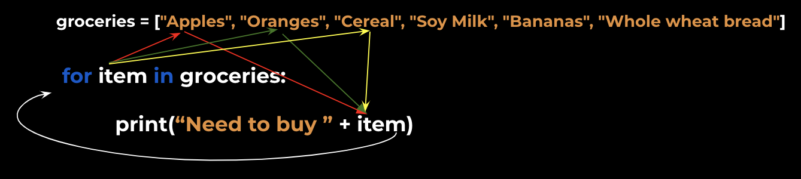

Typically we loop "through" a list. That is, we want to execute some operation for every item in a list.

Python provides convenient syntax for looping through lists:


```
groceries = ["Apples", "Oranges", "Cereal", "Soy Milk", "Bananas", "Whole wheat bread"]

for item in groceries:
	print("Need to buy " + item)
```

Executing the above code will output a new line for each element in the list, with each looking similar:
- Need to buy Apples
- Need to buy Oranges
- etc

Note that we could call `item` anything - it is just a placeholder variable to represent each item in `groceries`

In other words, this code would work **exactly the same**:


```
for qzwc in groceries:
	print("Need to buy " + qzwc)
```

It's just a variable name - we care about the value inside it.


<hr/>


We call this a loop because it literally "loops" through this process:

1. Get next item from list
2. Execute operation with item


Visually, you can think of it like this:




With the following steps:


1. <span style="color:red">Initially, the value of `item` is `Apples`</span>
2. <span style="color:red">We execute the operation we need to do with this `item` (in this case, `print`)</span>
3. Because there are more elements in the list, we start the loop again
4. <span style="color:limegreen">Now the value of `item` is `Oranges`</span>
5. <span style="color:limegreen">We again execute the operation, now with `Oranges` instead of `Apples`</span>
6. Because there are more elements in the list, we start the loop again
7. Repeat until the end of the list

<hr/>


Final note about syntax: notice that the concept of a **block** of code also applies here. In other words, anything that we want to happen on each iteration of the loop **must** be indented accordingly.