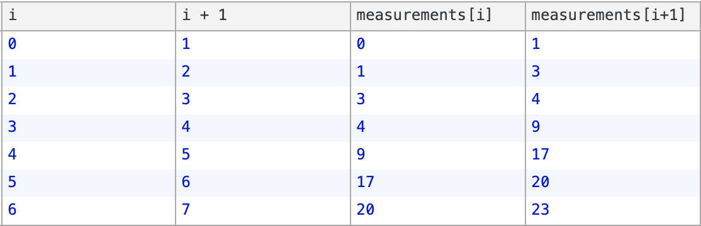

Something programmers love to do is sort lists, or validate that lists are sorted.


Given this list of numbers:


```
print("It *seems* like it's in order...")

measurements = [0, 1, 3, 4, 9, 17, 20, 23, 34, 36, 37, 44, 52, 56, 58, 73, 76, 78, 80, 82, 84, 90, 91, 94, 96, 101, 104, 106, 107, 108, 109, 113, 115, 122, 124, 129, 132, 133, 135, 137, 138, 143, 152, 158, 161, 166, 168, 176, 183, 185, 195, 196, 199, 206, 207, 208, 213, 221, 216, 232, 233, 241, 249, 250, 251, 262, 263, 264, 267, 268, 275, 277, 280, 282, 286, 288, 293, 295, 297, 310, 312, 315, 319, 328, 343, 348, 353, 358, 365, 373, 376, 382, 384, 388, 389, 396, 397]
```

We can write the following loop to determine whether the numbers are really in ascending (going up) order:


```
last_index = len(measurements) - 1
in_order = True

for i in range(0, last_index):
	if measurements[i] > measurements[i+1]:
		in_order = False

if in_order:
	print("All numbers in ascending order")
else:
	print("Not in order!")
```

Let's break this down:


1. First we define the `in_order` boolean with an initial value of `True`
    - If at any point in our loop we detect that something is out of order, we change this to `False` and then we're done
2. Next we start our loop:
    - We want to loop through the entire list, so we're going from 0 (first index in any list) to `last_index`, which is another variable we defined that holds the value of the last index in `measurements`
    - In the loop we do a simple check: is the current number (at index `i`) greater than the next* number (at index `i+1`) ?
      - If it is, then we can change `in_order` to `False`, because each number should be smaller than the on e after it
3. Finally, once we finish looping, all we have left to do is print the result, depending on the value of `in_order`


*The interesting part in this loop is the comparison of `measurements[i]` and `measurements[i+1]` - check out this table where we break down each step in the loop:





As you can see, `measurements[i]` and `measurements[i+1]` are always one after the other, which is why this is method works for determining whether the array is sorted.