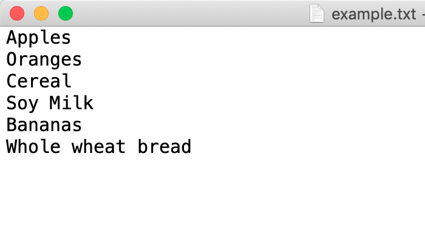

To code along with this explanation, please make sure you have a file called `example.txt` that looks like this:



The commands to read the file are simple, but in order for them to work make sure the `.txt` file and your code are saved in the same directory, **and** that you're executing your code from the same directory:

```
the_file = open("example.txt")
groceries = the_file.read().split("\n") 
```

Now the value of groceries will be a list of all the items inside the file. The important parts in the above commands are:


1. The file name - for example, `example.txt`
2. The `split` command
3. When Python reads a file using the `open` command, it reads it as a *string*, which is less convenient to work with when we're handling lots of data.
4. Therefore, we use `split` to *split* the string into a list, which is more convenient
5. The `\n` - this indicates how each item in the file is split. In our example, each item is separated by a new line, so we use the `/n` to tell Python to look at each new line in the file as a separate `item` for our list.


If we were to run the code `print(groceries)` following the above, we would see this list as the result:

```
["Apples", "Oranges", "Cereal", "Soy Milk", "Bananas", "Whole wheat bread"]
```

Now that we have the groceries variable - we can do whatever we like with it, it's just a list!


**Note:** modifying the items in groceries will not update the file. We'll see how to write to files later.
