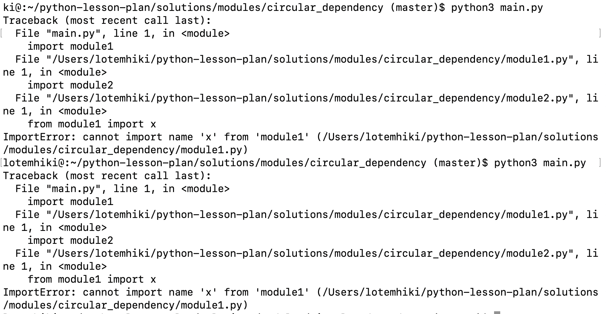

One Edge Case you need to be careful with is circular dependency.

The simplest example is `moduleA` that imports `moduleB` that imports `moduleA`:

If you run the code you will get an error that will look something like that:

We can see that from the main we try to import `moduleA`, which imports `moduleB` which imports `moduleA`, in that point Python notice the circle and throw an error.

**So, pay attention :)**
