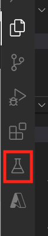
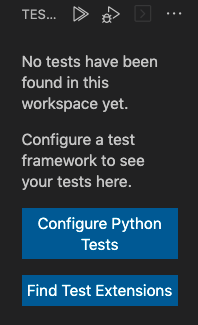
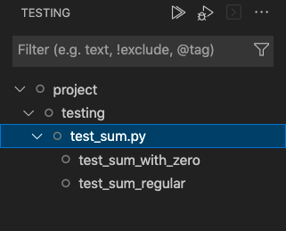
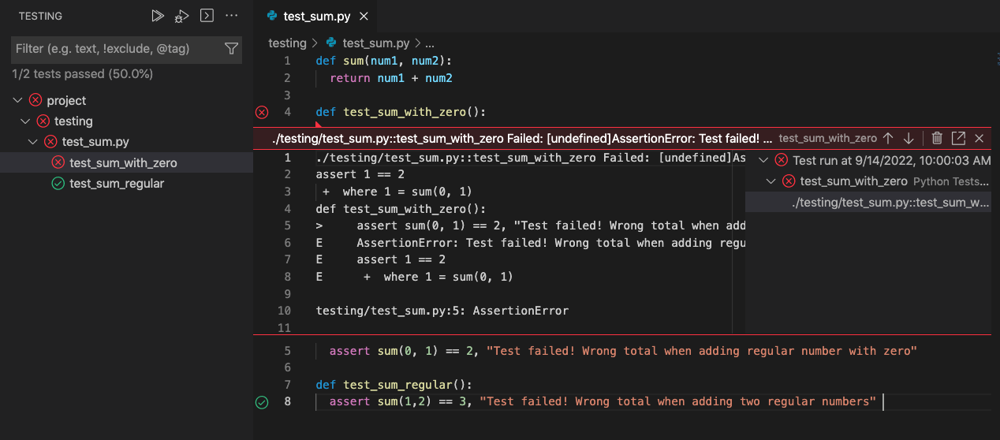

There are two ways to run tests using Pytest.


### Using command line
Navigate to the file path and type pytest , as we just saw:
```console
h-MacBook-Pro-sl-Shira:tests
shiranusboim$ pytest 
```

### Using VsCode

Click on the following Icon (that looks like a beaker)



|||important
## Note

if you do not see this icon. it means you do not have a python file (so make sure you add one and install the pytest library)
|||

once clicked you will see the following


click on **configure python Tests** and choose the `pytest` option. then choose the root directory for the tests.

if you have any tests in this directory, VsCode will recognize it and will you will be able to see the following (if you added the previous code we had)



you can click on the triangle button (run tests) to run your tests and you should see the following.


