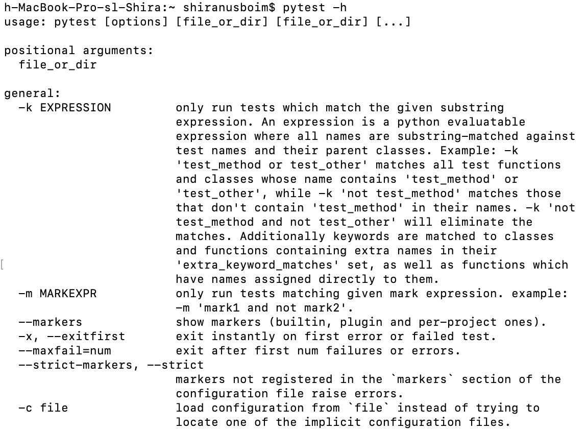

## Installation


From the terminal, you should run this command to install Pytest (using pip3):
```console
pip3 install pytest 
```

To check if the installation was successfully done, run this in the terminal:
```console
pytest -h 
```

If you see this output you are good to go:



**That's all.**
