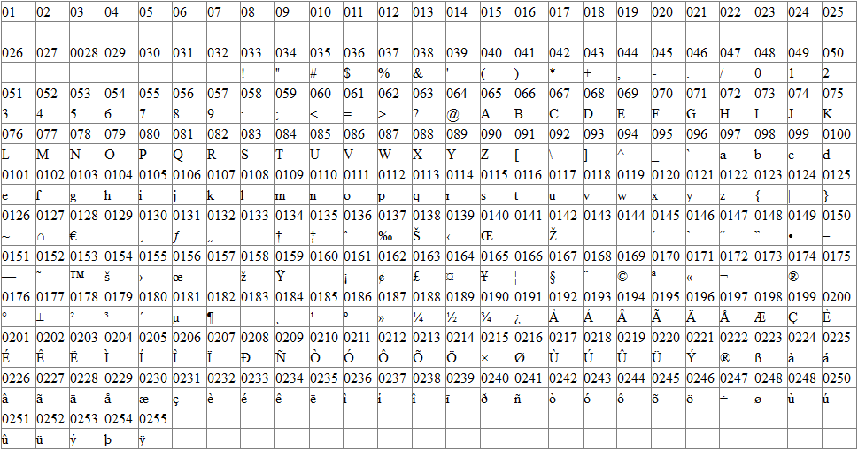

Let's take a look at the following problem.

We want to encode a string by moving each letter to the following one in the ABC.

For simplicity we will assume the text is only characters, all lower case.

    a -> b
    b -> c
    ...
    z -> a

How can we achieve that?

We know that we can't use the + operator with string and int:
```Python
"a" + 1 # will throw an error 
```

There is also no use to try to connect 1 as a string
```Python
"a" + str(1) 
```

But instead of converting the int to string, maybe we can try to convert the string into a number.

We might want something like that:
```Python
res = ""
for char in "text":
  number = get_number(char)
  number += 1
  next_char = parse_to_char(number)
  res += next_char 
```
Or:
```Python
res = "".join([parse_to_char(get_number(c)+1) for c in "text"]) 
```

If we think about how the computer works, we will remember that eventually everything is converted into a number, which in turn is converted into a bit representation, meaning 0 and 1 representation.

```console
The number 2 is represent in Binary as: 10
The number 33 is represent in Binary as: 100001
The number 9004 is represent in Binary as: 1110001000
```

How do numbers translated into numbers?


Simply, there is a table that decides for each number which character (letter, digit, #, etc) it represents.


The most basic table is the ASCII table:


Back at the beginning of computing everyone agreed that when indicated, certain numbers would represent certain characters. The decimal number 65 (Binary 1000001) would represent the character A, etc.

It was agreed that a byte (8 bits) would be reserved to store characters. This gives us 2^8 possible arrangements of bits that we can use to form 256 different characters.

There are 95 human readable characters specified in the ASCII table, including the letters A through Z both in upper and lower case, the numbers 0 through 9, a handful of punctuation marks and characters like the dollar symbol, the ampersand and a few others. 

It also includes 33 values for things like space, line feed, tab, backspace and so on. A number of values are only useful to a computer, like codes to signify the start or end of a text. In total there are 128 characters defined in the ASCII encoding, which is a nice round number (for people dealing with computers), since it uses all possible combinations of 7 bits (0000000, 0000001, 0000010 through 1111111).

So why isn't there 256?

So they added another 128 symbols which gives us the extended ASCII table:

