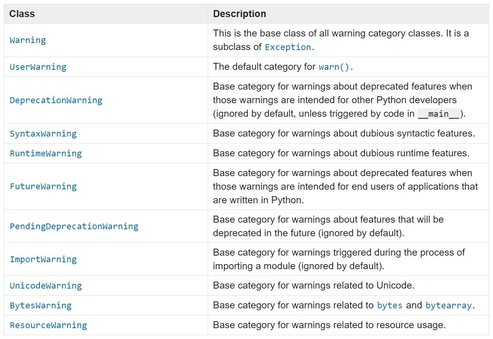

Warning are useful when we want to alert the user but we don't want to terminate the program.

For example when we know in the next version a function will be removed, then in the current version we can add a deprecation warning, that way the user will know that in the next version this function can't be used.

That's not a good reason to terminate the program but the user need to know that for future use.


Basic warning example:
```python
import warnings
warnings.warn('This is a warning message') 
```

After running the code above we get this log in the console:
```console
/Users/shiranusboim/PycharmProjects/untitled/warning.py:2:
UserWarning: This is a warning message 
```

The default warning is a UserWarning but you can change to different categories.

This categories are actually classes.

At 3.7 version the following warnings category classes are defined:




https://docs.python.org/3/library/warnings.html


Lets try a Deprecation Warning:

For example assume you want to delete [Fibonacci](https://www.mathsisfun.com/numbers/fibonacci-sequence.html) function in your next version:

```
import warnings

def recur_fibo(n):
  warnings.warn("Soon will be removed from this module \ and moved to math package", DeprecationWarning)
  if n <= 1:
    return n
  else:
    return(recur_fibo(n-1) + recur_fibo(n-2))

recur_fibo(10)
```

After running the code above we get this log in the console:
```python
/Users/shiranusboim/PycharmProjects/untitled/warning.py:6: DeprecationWarning: Soon will be removed from this module and moved to math package", DeprecationWarning 
```

Not all warning are shown to us by default, those are set to ignore and not shown to user:
```
ignore::PendingDeprecationWarning
ignore::ImportWarning
ignore::ResourceWarning 
```
For example:
```
warnings.warn("This is ignored", ImportWarning) 
```

For this command nothing will happen, the reason is each time a warning is issued, a determination is made whether a message should be issued or not.

This determination is made by the warning filter, the filter is sequence of matching rules, that we can add by calling `filterwarnings()`, but first let's understand the simple filter.


### simplefilter()


We can control the warning by using a simple filter.

`simplefilter()` takes two arguments:

1. **action** - what action to take for warnings
2. **category** - on which classes of warning to take the action. default is all warning.


**The actions:**

- "default" - print the first occurrence of matching warnings for each location

- "error" - turn matching warnings into exceptions

- "ignore" - never print matching warnings

- "always" - always print matching warnings

- "module" - print the first occurrence of matching warnings for each module where the warning is issued (regardless of line number)

- "once" - print only the first occurrence of matching warnings, regardless of location


so let's try to warn an ImportWarning again:
```python
import warnings
# Cause all warnings to always be triggered.
warnings.simplefilter("always")
warnings.warn("This is ignored NO MORE", ImportWarning) 
```
```console
/Users/shiranusboim/PycharmProjects/untitled/warning.py:4: 
ImportWarning: This is ignored NO MORE
```

### filterwarning()


The filter warning can search message text of warnings using [regular expressions](https://en.wikipedia.org/wiki/Regular_expression)

```python
import warnings
warnings.filterwarnings("always",r".*NO MORE", ImportWarning)
warnings.warn("This is ignored NO MORE", ImportWarning) 
```

will print the warning. Try it yourself.