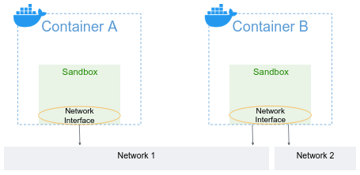

It's time to face hard questions about container networking. The core idea of containers is **isolation**, so how can a container communicate with other containers over the network? How can a container communicate with the public internet? It must use the host machine network resources. How can that be implemented while keeping the host machine secure enough?

Docker implements a virtualized layer for container networking, enabling communication and connectivity between Docker containers, as well as between containers and the external network. It includes all the traditional stacks we know - unique IP addresses for each container, virtual network interface that the container sees, default gateway, and route table.

Below is the virtualized model scheme. In Docker, this model is implemented by `libnetworking` library:

A **sandbox** is an isolated network stack. It includes Ethernet interfaces, ports, routing tables, and DNS configurations.

**Network Interfaces** are virtual network interfaces (e.g. `veth`). Like normal network interfaces, they're responsible for making connections between the container and the rest of the world.

Network interfaces connect the sandbox to networks.

A **Network** is a group of network interfaces that are able to communicate with each other directly. An implementation of a Network could be a Linux bridge, a VLAN, etc.

This networking architecture is not exclusive to Docker. Docker is based on an open-source pluggable architecture called the [**Container Network Model** (CNM)](https://github.com/moby/libnetwork/blob/master/docs/design.md).

The networks that containers are connecting to are pluggable, using network drivers. This means that a given container can communicate to different kinds of networks, depending on the driver. Here are a few common network drivers docker supports:
- `bridge`: This network driver connects containers running on the **same** host machine. If you don't specify a driver, this is the default network driver.
- `host`: This network driver connects the containers to the host machine network - there is no isolation between the container and the host machine, and uses the host's networking directly.
- `overlay`: Overlay networks connect multiple containers on **different machines**, as if they are running on the same machine and can talk locally.
- `none`: This driver disables the networking functionality in a container.

# The Bridge Network Driver
The Bridge network driver is the default network driver used by Docker. It creates an internal network bridge on the host machine and assigns a unique IP address to each container connected to that bridge. Containers connected to the Bridge network driver can communicate with each other using these assigned IP addresses. The driver also enables containers to communicate with the external network through port mapping or exposing specific ports.

The [default bridge network](https://docs.docker.com/network/network-tutorial-standalone/#use-the-default-bridge-network) official tutorial demonstrates how to use the default bridge network that Docker sets up for you automatically.

The [user-defined bridge network](https://docs.docker.com/network/network-tutorial-standalone/#use-user-defined-bridge-networks) official tutorial shows how to create and use your own custom bridge networks, to connect containers running on the same host machine.

Complete both **Use the default bridge network** and **Use user-defined bridge networks** tutorials.

# The Host network driver
The Host network driver is a network mode in Docker where a container shares the network stack of the host machine. When a container is run with the Host network driver, it bypasses Docker's virtual networking infrastructure and directly uses the network interfaces of the host. This allows the container to have unrestricted access to the host's network interfaces, including all network ports. However, it also means that the container's network stack is not isolated from the host, which can introduce security risks.

Complete Docker's short tutorial that demonstrates the use of the host network driver: https://docs.docker.com/network/network-tutorial-host/

# IP address and hostname
By default, the container is allocated with an IP address for every Docker network it attaches to. A container receives an IP address out of the IP pool of the network it attaches to. The Docker daemon effectively acts as a DHCP server for each container. Each network also has a **default subnet** mask and **gateway**.

As you've seen in the tutorials, when a container starts, it can only attach to a single network, using the `--network` flag. You can connect a running container to multiple networks using the `docker network connect` command.

In the same way, a container’s hostname defaults to be the container’s ID in Docker. You can override the hostname using `--hostname`.