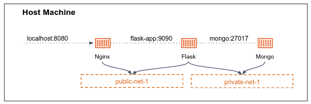

## Exercise 1 - Inspecting container networking

Run the `busybox` image by:

```bash
docker run -it busybox /bin/sh
```

1. On which network this container is running?
2. What is the name of the network interface that the container is connected to, as it is seen from the host machine?
3. What is the name of the network interface that the container is connected to as it is seen from within the container?
4. What is the IP address of the container?
5. Using the `route` command, what is the default gateway ip that the container use to access the internet?
6. Provide an evidence that the container's default gateway IP is the IP address of the default bridge network on the host machine the container is running on.
7. What are the IP address(es) of the DNS server the container used to resolve hostnames? Provide an evidence that they are identical to the DNS servers host machine.
8. Create a new bridge network, connect your running container to this network.
9. Provide an evidence that the container has been connected successfully to the created network.
10. From the host machine, try to `ping` the container using both its IP addresses.
11. After you've connected the container to a custom bridge network, what are the IP address of the DNS server the container used to resolve hostnames? What does it mean?

## Exercise 2 -  Flask, Nginx, MongoDB

Your goal is to build the following architecture:



- The Dockerfiles of the nginx and the flask apps can be found in our shared repo under `nginx_flask_mongodb`.
- The mongo app should be run using the pre-built [official Mongo image](https://hub.docker.com/_/mongo).
- The nginx and flask app should be connected to a custom bridge network called `public-net-1` network.
- In addition, the flask app the mongo should be connected to a custom bridge network called `private-net-1` network.
- The nginx should talk with flask using the `flask-app` hostname.
- The flask app should talk to the mongo using the `mongo` hostname.

