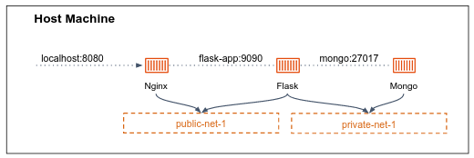

# Exercise - Flask, Nginx, MongoDB
Create `docker-compose.yaml` file for the following containers architecture:

- The Dockerfiles of the nginx and the flask services can be found in our shared repo under `nginx_flask_mongodb`.
- The mongo service should be run using the pre-built [official Mongo image](https://hub.docker.com/_/mongo). **The database data should be persistent**.
- The nginx and flask services should be connected to a custom bridge network called `public-net-1` network.
- In addition, the flask service and mongo should be connected to a custom bridge network called `private-net-1` network.
- The nginx should talk with flask using the `flask-app` hostname.
- The flask service should talk to the `mongo` using the mongo hostname.

<details>
  <summary>
     Solution
  </summary>

```bash
version: "3.9"
services:
  mongo:
    image: mongo
    volumes:
      - mongoVol:/data/db
    networks:
      - private-net-1
  flask-app:
    build:
      context: flask-app
    depends_on:
      - mongo
    networks:
      - private-net-1
      - public-net-1
  nginx:
    build:
      context: nginx
    ports:
      - "8080:80"
    depends_on:
      - flask-app
    networks:
      - private-net-1
volumes:
  mongoVol: {}
networks:
  public-net-1:
    driver: bridge
  private-net-1:
    driver: bridge
```

</details>