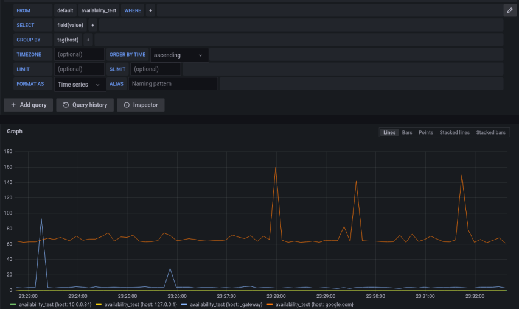

# Exercise 1 - Communication Between Containers and the Internet
Run two `ubuntu` containers named `ubuntu1` and `ubuntu2`. Use the `-it` flags to make an interactive interaction with the running containers using a tty terminal.

Your goal is to be able to successfully `ping` the `ubuntu1` container from `ubuntu2`, i.e. to verify communication between the two containers. Install ping if needed and `inspect` the containers to discover their IP addresses.

<details>
  <summary>
     Solution
  </summary>

1. Run the first Ubuntu container named `ubuntu1`:
    ```bash
    docker run -it --name ubuntu1 ubuntu
    ```
1. Install `ping` in the `ubuntu1` container. Once inside the `ubuntu1` container, install `ping` by running the following command:
    ```bash
    apt update && apt install -y iputils-ping
    ```
1. Open a new terminal, and run the second Ubuntu container named `ubuntu2`:
    ```bash
    docker run -it --name ubuntu2 ubuntu
    ```
1. Inspect the containers to discover their IP addresses:
    ```bash
    docker inspect -f '{{range.NetworkSettings.Networks}}{{.IPAddress}}{{end}}' ubuntu1
    docker inspect -f '{{range.NetworkSettings.Networks}}{{.IPAddress}}{{end}}' ubuntu2
    ```
1. Ping `ubuntu1` from `ubuntu2`. Inside the `ubuntu2` container:
    ```bash
    ping <ubuntu1_IP_address>
    ```
1. Replace `<ubuntu1_IP_address>` with the actual IP address of `ubuntu1`.

If the communication is successful, you should see the ping command sending and receiving packets between the containers.

</details>

# Exercise 2 - Availability Test Service
In this exercise, you will run a bash script which continuously monitors the availability of a predetermined set of servers using the `ping` command. It sends the ping results to an [InfluxDB database](https://www.influxdata.com/) and displays results in the [Grafana dashboard](https://grafana.com/grafana/dashboards/).

InfluxDB is a time-series database designed to handle high volumes of time-stamped data. The database is listening on port `8086`, which should be published to the host machine.

Grafana is an open-source platform for data visualization and monitoring. The server is listening on port `3000`, which should be published to the host machine as well.

No need to install the InfluxDB or Grafana on your system, as they will be run as containers in pre-built images. Before you run the availability test script, let's run the [InfluxDB container](https://hub.docker.com/_/influxdb) and the [Grafana container](https://hub.docker.com/r/grafana/grafana-oss).
1. Run the InfluxDB container first. **You should run a specific image version:** `influxdb:1.8.10`. In the `docker run` command, define the `INFLUXDB_ADMIN_USER` and `INFLUXDB_ADMIN_PASSWORD` with a custom admin user and password of your choice. Furthermore, define `INFLUXDB_HTTP_AUTH_ENABLED` to be equal to `true`.
1. In order to write data to InfluxDB, we need to create a database first. In another new terminal session, create a database named `hosts_metrics` in which the test data will be stored. To do so, perform the following POST HTTP request:
    ```bash
    curl -X POST 'http://localhost:8086/query' -u <your-username>:<your-password> --data-urlencode "q=CREATE DATABASE hosts_metrics"
    ```
    Upon successful creation, you'll get the following output: 
    ```bash
    {"results":[{"statement_id":0}]}
    ```
1. Next, run the Grafana container, publish the relevant ports. After initialization, visit your server in http://localhost:3000.
    1. Default username and password is `admin`.
    1. Now we want to integrate InfluxDB as a data source in Grafana. On the left menu, under the **Configuration** button, click **Data sources**.
    1. In the opened configuration console, choose **Add data source**, then choose **InfluxDB**.
    1. In the data source setting page, under the **HTTP** section **URL** field, enter influxDB url: `http://<influc-db-container-ip>:8086`.
    1. In **Auth** section, turn on the **Basic auth** toggle, and enter the InfluxDB username and password in the appropriate fields below.
    1. In **InfluxDB Details** section, under **Database** enter your db name: `hosts_metrics`.
    1. Finally, click **Save & Test**, and make sure you get the *Data source is working* message.

1. Now you are ready to run the availability test script. The code is available under `availability_agent/agent.sh` in our shared repo. In the `agent.sh` file, change the variables according to your username and password:
    ```bash
    DB_USERNAME="<your-username>"
    DB_PASSWORD="<your-password>"
    ```
1. Run the script by:
    ```bash
    cd availability_agent
    bash agent.sh
    ```
    The running script should start to monitor the hosts specified in the `hosts` file, and write the results into InfluxDB.
1. Let's visualize the results in Grafana.
1. In the grafana server, click the **Explore** button. In the exploration panel, build a graph of the test results over time. Your graph should look similar to the screenshot below.


<details>
  <summary>
     Solution
  </summary>

The running command of the influxDB is:
```bash
docker run --rm --name influxdb -p 8086:8086 -e INFLUXDB_ADMIN_USER=admin -e INFLUXDB_ADMIN_PASSWORD=12345678 -e INFLUXDB_HTTP_AUTH_ENABLED=true influxdb:1.8.10
```
The running command for grafana is:
```bash
docker run --rm --name grafana -p 3000:3000 grafana/grafana-oss
```

</details>