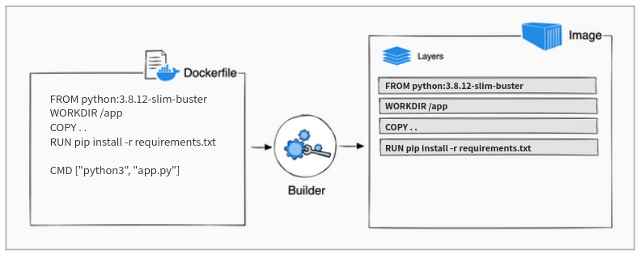

Roughly speaking, each instruction in a Dockerfile translates to an **image layer**. The following diagram illustrates how a Dockerfile translates into a stack of layers in a container image.

Let's inspect our built image to see how many layers it is composed by:
```bash
$ docker inspect my_flask_app:0.0.1
...

"Layers": [
    "sha256:e5baccb54724b971f73bbfa46d477b947c9066e4040d0e002e8f04314f58b58f",
    "sha256:5d5d684babe65e924137de0350bce27de63e020f36f90df2df3945b815da987a",
    "sha256:469c8dbcb08a7df265edd06cbf957468d3fd73d3add2c9019c18489eae25b0e7",
    "sha256:e41449df8276a577a88196e62e8c5d6d5dc563d5a3f492df2f286d644e514e5c",
    "sha256:6fafa3f6471656dc070c41adb6871731228515ba93f665c0b1c021ac66aeb27d",
    "sha256:40182d322937358effd2025643dc18ef2cb4d3fdd57817db23dcad0b62bd213f",
    "sha256:ae7b28ccc5a71e49f37d8a616b0f759d65a4fb6355e0802f019030f76bcdf903",
    "sha256:61752aa4479e659cdf4e448734c799bcb8d06622ccc939bf0f6188bb98512219"
]

...
```
The above example shows the 8 layers that the `my_flask_app:0.0.1` image is composed of.

Further inspection can discover that the first 5 layers belongs to the base image:
```bash
$ docker inspect python:3.8.12-slim-buster
...
"Layers": [
    "sha256:e5baccb54724b971f73bbfa46d477b947c9066e4040d0e002e8f04314f58b58f",
    "sha256:5d5d684babe65e924137de0350bce27de63e020f36f90df2df3945b815da987a",
    "sha256:469c8dbcb08a7df265edd06cbf957468d3fd73d3add2c9019c18489eae25b0e7",
    "sha256:e41449df8276a577a88196e62e8c5d6d5dc563d5a3f492df2f286d644e514e5c",
    "sha256:6fafa3f6471656dc070c41adb6871731228515ba93f665c0b1c021ac66aeb27d",
]
...
```
The rest 3 layer are the ones create by the `WORKDIR`, `COPY` and `RUN` instructions in our Dockerfile. 

In general, each Dockerfile instruction that modify the image file system creates a new layer.
This is why the `CMD` instruction (as opposed to `WORKDIR`, `COPY` and `RUN`) doesn't add another layer since it not changing the file system but only specify the container running command. 

# Layer Caching
When you run a build, docker attempts to reuse layers from earlier builds. If a layer of an image is unchanged, then docker picks it up from the build cache. If a layer has changed since the last build, that layer, **and all layers that follow**, must be rebuilt.

The Dockerfile from the previous section copies all project files to the container (`COPY . .`) and then downloads and installs application dependencies in the following step (`RUN pip install -r requirements.txt`). If you were to change any of the project files, that would invalidate the cache for the `COPY` layer. It also invalidates the cache for all of the layers that follow.


The current order of the Dockerfile instruction makes it so that the builder must download and install the Python dependencies again, despite none of the packages having changed since last time.

You can avoid this redundancy by reordering the instructions in the Dockerfile.