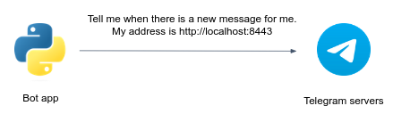
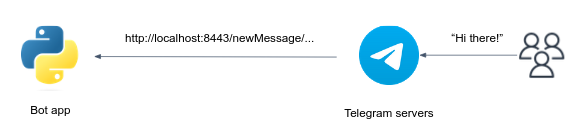

## Running the Telegram bot locally

The Telegram app is a flask-based service that responsible for providing a chat-based interface for users to interact with your image object detection functionality. 
It utilizes the Telegram Bot API to receive user images and respond with detected objects. 

The code skeleton for the bot app is already given to you under `polybot/app.py`.
In order to run the server, you have to [provide 2 environment variables](https://www.jetbrains.com/help/objc/add-environment-variables-and-program-arguments.html#add-environment-variables):

1. `TELEGRAM_TOKEN` which is your bot token.
2. `TELEGRAM_APP_URL` which is your app public URL provided by Ngrok (will be discussed soon).

Implementing bot logic involves running a local Python script that listens for updates from Telegram servers.
When a user sends a message to the bot, Telegram servers forward the message to the Python app using a method called **webhook** (**long-polling** and **websocket** are other possible methods which wouldn't be used in this project).
The Python app processes the message, executes the desired logic, and may send a response back to Telegram servers, which then delivers the response to the user.

The webhook method consists of simple two steps:

Setting your chat app URL in Telegram Servers:




Once the webhook URL is set, Telegram servers start sending HTTPS POST requests to the specified webhook URL whenever there are updates, such as new messages or events, for the bot. 




You've probably noticed that setting `localhost` URL as the webhook for a Telegram bot can be problematic because Telegram servers need to access the webhook URL over the internet to send updates.
As `localhost` is not accessible externally, Telegram servers won't be able to reach the webhook, and the bot won't receive any updates.

[Ngrok](https://ngrok.com/) can solve this problem by creating a secure tunnel between the local machine (where the bot is running) and a public URL provided by Ngrok.
It exposes the local server to the internet, allowing Telegram servers to reach the webhook URL and send updates to the bot.

Sign-up for the Ngrok service (or any another tunneling service to your choice), then install the `ngrok` agent as [described here](https://ngrok.com/docs/getting-started/#step-2-install-the-ngrok-agent). 

Authenticate your ngrok agent. You only have to do this once:

```bash
ngrok config add-authtoken <your-authtoken>
```

Since the telegram bot service will be listening on port `8443`, start ngrok by running the following command:

```bash
ngrok http 8443
```

Your bot public URL is the URL specified in the `Forwarding` line (e.g. `https://16ae-2a06-c701-4501-3a00-ecce-30e9-3e61-3069.ngrok-free.app`).
Don't forget to set the `TELEGRAM_APP_URL` env var to your URL. 

In the next step you'll finally run your bot app.

## Running a simple "echo" Bot - the `Bot` class

Under `polybot/bot.py` you are given a class called `Bot`. This class implements a simple telegram bot, as follows.

The constructor `__init__` receives the `token` and `telegram_chat_url` arguments.
The constructor creates an instance of the `TeleBot` object, which is a pythonic interface to Telegram API. You can use this instance to conveniently communicate with the Telegram servers.
Later, the constructor sets the webhook URL to be the `telegram_chat_url`. 

The `polybot/app.py` is the main app entrypoint. It's nothing but a simple flask webserver that uses a `Bot` instance to handle incoming messages, caught in the `webhook` endpoint function.

The default behavior of the `Bot` class is to "echo" the incoming messages. Try it out!

## Extending the echo bot - the `QuoteBot` class

In `bot.py` you are given a class called `QuoteBot` which **inherits** from `Bot`.
Upon incoming messages, this bot echoing the message while quoting the original message, unless the user is asking politely not to quote.

In `app.py`, change the instantiated instance to the `QuoteBot`:

```python
- Bot(TELEGRAM_TOKEN, TELEGRAM_APP_URL)
+ QuoteBot(TELEGRAM_TOKEN, TELEGRAM_APP_URL)
```

Run this bot and check its behavior.

## Build the object detection bot - the `ObjectDetectionBot` class

Under `bot.py` you'll find the class `ObjectDetectionBot` with a `handle_message()` method that handles incoming messages from end-users.
When users send an image to the bot, you first have to download this image to the local file system, then to upload this image to an S3 bucket and perform an HTTP request to the `yolo5` service to predict the objects in this image.

Complete the `# TODO`s in `bot.py` to achieve this behavior.

Here is an end-to-end example of how it may look like when all your microservices are running. Feel free to send the results to the user in any other form.


