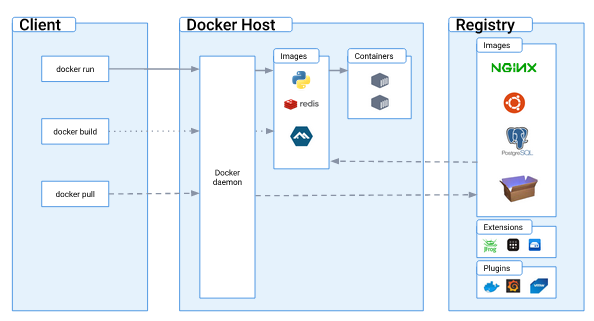

**Docker** is an open platform for developing, building and shipping images, and running containers.

Docker container technology was launched in 2013 as an open source [Docker Engine](https://www.docker.com/products/container-runtime/).

Docker uses a client-server architecture. The Docker client talks to the Docker daemon, which does the heavy lifting of building, running, and distributing your Docker containers. The Docker client and daemon can run on the same system or you can connect a Docker client to a remote Docker daemon. The Docker client and daemon communicate using a REST API, over UNIX sockets or a network interface. Another Docker client is Docker Compose, which lets you work with applications consisting of a set of containers.

- The Docker daemon (`dockerd`) listens for Docker API requests and manages Docker objects such as images, containers, networks, and volumes.
- The Docker client (`docker`) is the primary way that many Docker users interact with Docker. When you use commands such as docker run, the client sends these commands to dockerd, which carries them out.
- A Docker registry stores Docker images. [Docker Hub](https://hub.docker.com/) is a public registry that anyone can use, and Docker is configured to look for images on Docker Hub by default. You will even run your own private registry later on in the course.