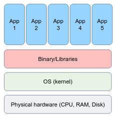
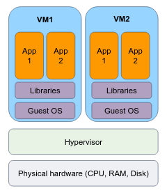
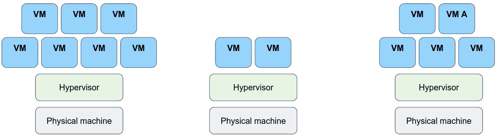
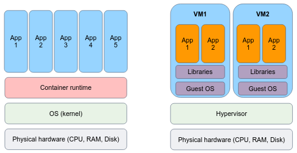

# Bare metal systems
In the pre-virtualization era, applications were typically executed directly on the OS system and often referred to as "bare metal". You are likely already familiar with this concept as it is what you do when you install and run programs on your personal computer or laptop. There is no "virtualized" layer, everything is running in the same environment.

Bare metal systems involve installing and running the operating system, binaries/libraries, and applications directly on the physical hardware. While it provides direct hardware access and customization options, it can lead to significant challenges in production systems:
- **Dependency Conflicts**: Bare metal systems can suffer from complex dependency conflicts, making it challenging to manage software libraries and versions, leading to compatibility issues.
- **Resource Underutilization**: Since applications run directly on the physical hardware, resource utilization can be inefficient, as each application may require dedicated hardware resources even when they are not fully utilized.
- **Limited Scalability**: Scaling a bare metal system involves physically provisioning and configuring new hardware, which can be time-consuming and costly compared to more flexible virtualized or containerized environments.
-** Lack of Flexibility**: Bare metal systems lack the flexibility to quickly switch between different operating systems or runtime environments, restricting experimentation and limiting the adoption of different technologies.
- **High Maintenance Overhead**: Managing and maintaining bare metal systems typically requires manual configuration, patching, and updates for both the hardware and software components, resulting in higher administrative overhead.
- **Long Deployment Times**: Provisioning and decommissioning bare metal servers can be a time-intensive process, involving physical setup, installation, and configuration, leading to slower deployment cycles.
- **Limited Fault Isolation**: Failures or issues in one application or component of a bare metal system can have a wide-ranging impact on other applications or services running on the same hardware, potentially leading to system-wide disruptions.
- **Higher Costs**: Bare metal systems often require significant upfront capital investment for hardware infrastructure, and the cost of maintaining and upgrading hardware can be expensive compared to more agile and scalable alternatives.

# Virtual Machines
Virtual machines (VMs) are an abstraction layer that enables the creation and operation of multiple isolated instances of virtual hardware within a single physical host. This is made possible through a software component called a **hypervisor** or "virtual machine monitor" (VMM), which partitions the host resources and allows each VM to have its own virtualized hardware configuration, including an operating system, binaries/libraries, and applications. VMs provide a way to consolidate multiple independent environments on a single physical server, offering flexibility, isolation, and the ability to run different operating systems and software stacks concurrently.

VMs offer several advantages:
- **Isolation**: VMs provide strong isolation between different instances running on the same physical host. Each VM operates in its own virtual environment, ensuring that applications and processes within one VM do not interfere with others, providing enhanced security and stability.
- **Hardware Abstraction**: VMs abstract the underlying physical hardware, allowing applications to run on virtualized hardware configurations. This enables greater flexibility in deploying applications, as VMs can be provisioned with specific resources such as CPU, memory, and storage tailored to the application's requirements.
- **Operating System Flexibility**: VMs allow for the simultaneous execution of multiple operating systems on a single physical host. This flexibility is valuable when running applications that have dependencies on different operating systems or when testing software compatibility across various OS environments.
- **Resource Optimization**: VMs enable efficient utilization of hardware resources. Multiple VMs can run on a single physical host, effectively consolidating workloads and optimizing resource allocation. This can lead to higher overall resource utilization and cost savings by maximizing the use of available hardware.
- **Snapshotting and Rollbacks**: VMs often support snapshotting, allowing you to capture the entire state of a VM at a specific point in time. This feature is useful for creating backups, performing software testing, or quickly rolling back to a previous state in case of issues or failures.
- **Scalability and Elasticity**: VMs can be easily cloned or duplicated to scale up or down the infrastructure based on demand. It simplifies the process of adding or removing VM instances to meet changing workload requirements, providing scalability and elasticity to adapt to dynamic environments.
- **Migration and High Availability**: VMs can be migrated or live-migrated from one physical host to another without significant service interruptions. This feature allows for load balancing, system maintenance, and improved availability, by seamlessly transferring VMs between hosts without disrupting the running applications.
- **Testing and Development Environments**: VMs are widely used for creating isolated testing and development environments. Developers can have dedicated VMs to test software configurations, simulate different network setups, and experiment with new applications without affecting the production environment.

A cluster of physical hardware can support the operation of thousands of virtual machines (VMs), enabling efficient resource utilization, scalability, and recovery from failure.

# Containers
Containers offer a similar level of isolation for installing and configuring binaries/libraries as virtual machines, but they differ in their approach. Instead of virtualizing at the hardware layer, containers utilize native Linux features like **cgroups** and **namespaces** to provide isolation while sharing the same kernel. This lightweight approach allows for faster startup times, improved resource efficiency, and easier scalability compared to traditional virtual machines.

Containers are an abstraction at the app layer that packages code and dependencies together. Multiple containers can run on the same machine and share the OS kernel with other containers, each running as isolated processes in user space. Containers take up less space than VMs (container images are typically tens of MBs in size), can handle more applications, and require fewer VMs and Operating systems.

Virtual machines (VMs) are an abstraction of physical hardware turning one server into many servers. The hypervisor allows multiple VMs to run on a single machine. Each VM includes a full copy of an operating system, the application, and necessary binaries and libraries, taking up tens of GBs. VMs can also be slow to boot.

The technology of containers plays an important role in modern software development and deployment for several reasons:
- **Lightweight and Portable**: Containers provide a lightweight and portable way to package applications and their dependencies. They encapsulate an application and its runtime environment, including libraries and dependencies, into a single container image that can run consistently across different environments and infrastructures. You build an image **once**, and can run it as a container **everywhere**.
- **Isolation and Resource Efficiency**: Containers offer process-level isolation, ensuring that each application runs in its own isolated environment. This isolation provides enhanced security and eliminates conflicts between applications. Containers also enable efficient utilization of system resources by sharing the host operating system kernel and avoiding the overhead of running a full virtual machine for each application.
- **Consistent and Reproducible Builds**: Containers enable consistent and reproducible builds by capturing the entire application stack, including dependencies and configurations, in a container image. This image can be versioned and shared, ensuring that the application can be built and deployed in the same way across different environments, making it easier to manage and deploy applications consistently.
- **Scalability and Elasticity**: Containers facilitate scalability and elasticity by allowing applications to be deployed and managed in a distributed and orchestrated manner. Container orchestration platforms like Kubernetes enable automatic scaling, load balancing, and high availability of containerized applications, making it easier to handle varying workloads and ensure application availability.
- **DevOps and Continuous Integration/Deployment (CI/CD)**: Containers align well with DevOps principles and enable streamlined CI/CD workflows. Containers provide a consistent environment for development, testing, and production, making it easier to package and deploy applications across different stages of the software development lifecycle. Containers can be integrated with CI/CD pipelines to automate the build, test, and deployment processes, improving development velocity and agility.