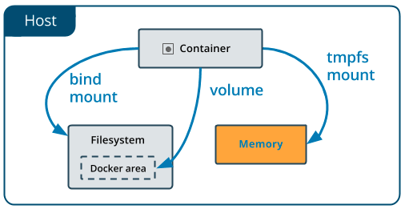

No matter which type of mount you choose to use, the data looks the same **from within the container**. It is exposed as either a directory or an individual file in the container’s filesystem.

An easy way to visualize the difference among volumes, bind mounts, and tmpfs mounts is to think about where the data lives on the host machine.

- **Volumes** are stored in a part of the host filesystem which is **managed by Docker** (`/var/lib/docker/volumes/` on Linux). Non-Docker processes should not modify this part of the filesystem.
- **Bind mounts** may be stored *anywhere* on the host system. They may even be important system files or directories. Non-Docker processes on the host machine or a Docker container can modify them at any time.
- `tmpfs` **mounts** are stored in the host system's memory only, and are never written to the host system's filesystem.